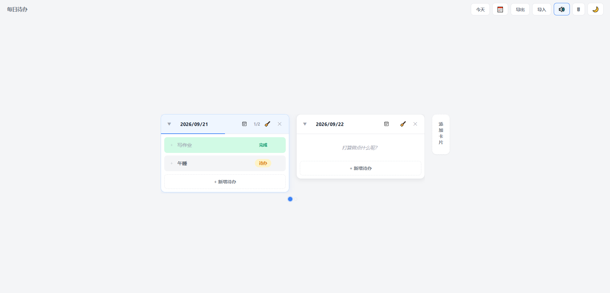

# daily-todo
# 每日待办

一个纯前端的待办清单，无需后端，数据保存在浏览器本地。

## 特点

- 按日期分卡片，向左滑动看历史，相当于一本行动日记
- 三态任务：待办 / 进行中 / 完成
- 任务可以拆成步骤
- 拖拽排序、跨卡片移动
- 完成时有分层庆祝动画：单条完成、整卡完成、今日全清
- 日历跳转、缩略条导航
- 明暗主题
- 数据导入导出

## 使用

打开 `index.html` 即可，或访问 GitHub Pages 地址。

## 数据说明

所有数据保存在浏览器的 localStorage 中。**换浏览器、清缓存、换设备都会丢失**。
请定期使用「导出」按钮备份，或使用「导入」恢复。

##截图

